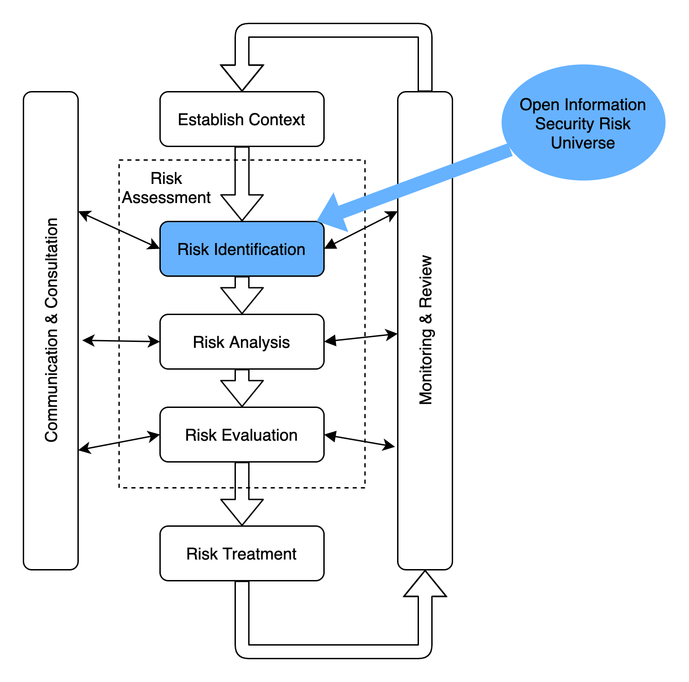
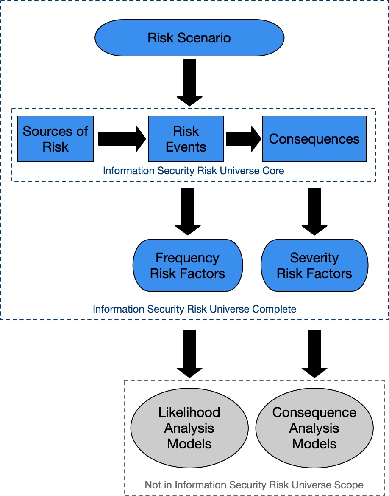

# Introduction

A Risk Universe provides a comprehensive view of the possible risks we face. This view is designed to aid in categorisation but also to act as a check on the scope of our risk identification exercises to ensure we don’t miss risks that then take us by surprise when they occur.

The goal of the Open Information Security Risk Universe (OISRU) is to provide a model and method independent framework and taxonomy for expressing and categorising security risk.

This framework should be complementary to the Basel II operational risk event types, recognising that information security risk permeates operational risk.

## Overview of the Risk Universe

The Open Information Security Risk Universe comprises, at it's core, Sources of Risk Events, Risk Events and Consequences of Risk Events. These are supplemented by Risk Factors that drive the Frequency or Severity of the Risks.

The Open Information Security Risk Universe does not directly address likelihood or controls as these are covered in other relevant analysis and evaluation methods.

## Definitions

**Risk**: *The effect of uncertainty on objectives. Usually expressed in terms of risk sources, possible events and their consequences and likelihood.* (Source: ISO 31000)

**Sources of Risk**: *Element which alone or in combination has the potential to give risk to risk.* (Source: ISO 31000)

**Risk Event**:  *Occurence or a change of a particular set of circumstances.* (Source: ISO 31000)

**Consequences**: *Outcome of an event affecting objectives.* (Source: ISO 31000)

**Likelihood**: *Chance of something occuring*. (Source: ISO 31000)

**Control**: *Measure that maintains or modifies risk*. (Source: ISO 31000)

## Other Relevant Standards

* NIST Special Publication 800-30 R1 Guide for conducting risk assessments* has a comprehensive set of threat sources (Risk Sources) in Appendix D, a *very* comprehensive set of threat events (Risk Events) in Appendix E and a list of effects of threat events (Consequences) in Appendix H.

* Octave Allegro has an indicative set of threat trees in Step 5 (Risk Sources) and in Appendix B includes the Impact Areas (Consequences) and in Appendix C includes Threat Scenarios (Risk Events).

Both of these standards are very useful and highly recommended sources but they do tie their taxonomy into specific qualitative methods for risk analysis. The goal of OSIRU is to be independent of any particular analysis model, whether quantitative or qualitative.

* ISO27005 includes a list of consequences in Appendix B.2.3 and Appendix C includes a mixed list of events and sources. Appendix C seems to use the term consequences in a somewhat muddled way.

## Contributors

The following people have contributed to this document:

* Phil Huggins
* Paul De Luca
* Robin Oldham
* Jordan M. Schroeder
* Tony Richards
* Alex Lucas

## License

 The Open Information Security Risk Universe is licensed under the Creative Commons Zero v1.0 Universal license. Please the project Github repository [https://github.com/oracuk/oisru](https://github.com/oracuk/oisru) for details.

  
